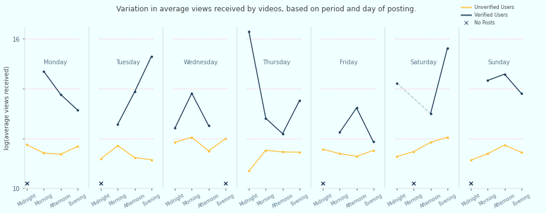

#### Scenario 1: Analysing Tiktok user-activity to understand how popularity of content can be associated with the time of uploading the content.

i. trending.json is the associated dataset.

ii. tiktok.png is the final visualisation.

iii. trending_description summarises the analysis, and statistical and design choices behind the visualisation.

iv. tiktok.py is the python code.

